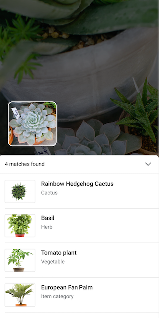

# ML Kit Showcase App with Material Design

This app demonstrates how to build an end-to-end user experience with [Google ML Kit APIs](https://developers.google.com/ml-kit) and following the [new Material for ML design guidelines](https://spec.googleplex.com/draft/mio-collections/machine-learning).

The goal is to make it as easy as possible to integrate ML Kit into your app with an experience that has been user tested:

* Visual search using the Object Detection & Tracking API - a complete workflow from object detection to product search in live camera and.

**TODO:** replace images with GIFs when publishing.

 


## Steps to run the app

* Clone this repo locally
  ```
  git clone https://github.com/firebase/mlkit-material-ios
  ```
* Find a `Podfile` in the folder and install all the dependency pods by running the following command:
  ```
  pod install --repo-update
  ```
* Opens the generated `ShowcaseApp.xcworkspace` file.
* [Create a Firebase project in the Firebase console, if you don't already have one.](https://firebase.google.com/docs/ios/setup) 
* Add a new iOS app into your Firebase project with bundle ID: ***com.google.firebase.ml.md***.
* Download `GoogleService-Info.plist` from the new added app and add it to the
  ShowcaseApp project in XCode. Remember to check `Copy items if needed` and
  select `Create folder references`.
* Select the project in XCode and find `Automatically manage signing` in
  `General` tab, uncheck this option, and choose your own provisioning file.
* Build and run it on an iOS device(It doesn't work on simulator).

## How to use the app

This app supports a senario to search for product using live camera:

* Open the app and points the camera at an object of interest.
* It shows a bounding box when it detects an object.
* Hold still for 1.5 seconds to confirm on the same object, it will trigger a product search to the server,and
  presents the result of product search in a bottom sheet on response.
* If user moves the camera quickly during confirming stage, the search will be cancelled.

**Note** that the visual search functionality here is mock since no real search backend has set up for this repository, but it should be easy to hook up with your own search service (e.g. [Product Search](https://cloud.google.com/vision/product-search/docs)) by only replacing return value of `APIKey`, `productSearchURL` and `acceptType` in `Models/FIRProductSearchRequest.m`.

## License
© Google, 2019. Licensed under an [Apache-2](./LICENSE) license.
